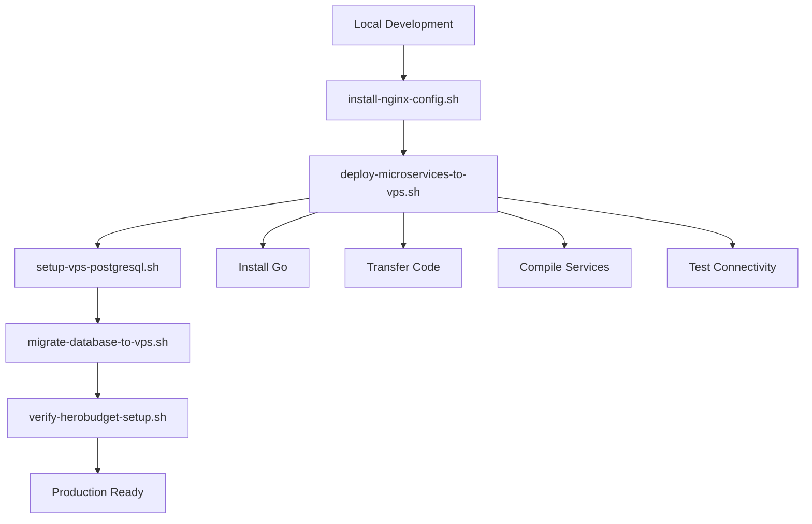

# 🎯 Hero Budget - Resumen de Deployment Completo

## 📋 Archivos Principales

| Archivo | Función | Descripción |
|---------|---------|-------------|
| **nginx-herobudget-config.conf** | Proxy Reverso | Configuración nginx con SSL, routing, seguridad |
| **install-nginx-config.sh** | Instalación | Setup automático del VPS con SSL |
| **deploy-microservices-to-vps.sh** | **🆕 Microservicios** | **Deployment completo de Go services** |
| **setup-vps-postgresql.sh** | Base de Datos | Configuración PostgreSQL en VPS |
| **migrate-database-to-vps.sh** | Migración | SQLite → PostgreSQL con backup |
| **verify-herobudget-setup.sh** | Verificación | Testing completo del sistema |

## 🚀 Proceso de Deployment (4 Pasos)

### 1. **Configurar Nginx y SSL**
```bash
./install-nginx-config.sh
```
✅ Instala nginx, genera SSL, configura proxy reverso

### 2. **🆕 Desplegar Microservicios** 
```bash
./deploy-microservices-to-vps.sh
```
✅ **Nuevo:** Instala Go, transfiere código, compila 18 servicios automáticamente

### 3. **Configurar Base de Datos**
```bash
./setup-vps-postgresql.sh
./migrate-database-to-vps.sh
```
✅ Instala PostgreSQL, migra datos SQLite

### 4. **Verificar Sistema**
```bash
./verify-herobudget-setup.sh
```
✅ Testing completo de endpoints, SSL, servicios

## 🏗 Arquitectura Completa

### Nginx (Puerto 443/80)
```
https://herobudget.jaimedigitalstudio.com
├── /health → Health check
├── /auth/google → google_auth:8081
├── /signup → signup:8082
├── /signin → signin:8084
├── /incomes → income_management:8093
├── /expenses → expense_management:8094
├── /budget → budget_management:8088
├── /savings → savings_management:8089
├── /cash-bank → cash_bank_management:8090
├── /bills → bills_management:8091
├── /profile → profile_management:8092
├── /categories → categories_management:8096
├── /budget-overview → budget_overview_fetch:8098
└── ... (18 microservicios total)
```

### **🆕 Microservicios Go (18 servicios)**
```
/opt/hero_budget/backend/
├── google_auth.exe (8081)
├── signup.exe (8082)
├── language_cookie.exe (8083)
├── signin.exe (8084)
├── fetch_dashboard.exe (8085)
├── reset_password.exe (8086)
├── dashboard_data.exe (8087)
├── budget_management.exe (8088)
├── savings_management.exe (8089)
├── cash_bank_management.exe (8090)
├── bills_management.exe (8091)
├── profile_management.exe (8092)
├── income_management.exe (8093)
├── expense_management.exe (8094)
├── transaction_delete_service.exe (8095)
├── categories_management.exe (8096)
├── money_flow_sync.exe (8097)
└── budget_overview_fetch.exe (8098)
```

### Base de Datos PostgreSQL
```
herobudget (database)
├── users (tabla principal)
├── herobudget_user (usuario)
└── HeroBudget2024!Secure (password)
```

## 🔧 Comandos de Gestión

### **🆕 Gestión de Microservicios**
```bash
# Iniciar todos los servicios
systemctl start herobudget

# Detener todos los servicios
systemctl stop herobudget

# Ver logs de servicios
tail -f /opt/hero_budget/logs/*.log

# Gestión manual
/opt/hero_budget/scripts/start_services.sh
/opt/hero_budget/scripts/stop_services.sh
```

### Gestión de Nginx
```bash
# Recargar configuración
nginx -t && systemctl reload nginx

# Ver logs
tail -f /var/log/nginx/herobudget_*.log

# Estado SSL
certbot certificates
```

### Gestión de Base de Datos
```bash
# Conectar a PostgreSQL
sudo -u postgres psql -d herobudget

# Backup manual
sudo -u postgres pg_dump herobudget > backup.sql

# Ver usuarios migrados
sudo -u postgres psql -d herobudget -c "SELECT COUNT(*) FROM users;"
```

## 🧪 Testing y Verificación

### **🆕 Testing de Microservicios**
```bash
# Health check general
curl https://herobudget.jaimedigitalstudio.com/health

# Testing de autenticación
curl -X POST https://herobudget.jaimedigitalstudio.com/auth/google \
  -H "Content-Type: application/json"

# Testing de APIs financieras
curl https://herobudget.jaimedigitalstudio.com/incomes
curl https://herobudget.jaimedigitalstudio.com/expenses
curl https://herobudget.jaimedigitalstudio.com/budget-overview
```

### SSL y Security
```bash
# Test SSL
openssl s_client -connect herobudget.jaimedigitalstudio.com:443

# Security headers
curl -I https://herobudget.jaimedigitalstudio.com
```

## 📈 **🆕 Nuevas Características**

### Deployment Automatizado de Microservicios
- ✅ **Instalación automática de Go 1.21.5**
- ✅ **Transferencia eficiente con rsync**
- ✅ **Compilación optimizada** (-ldflags="-s -w")
- ✅ **Configuración automática de PostgreSQL**
- ✅ **Scripts de gestión automática**
- ✅ **Testing de conectividad automático**

### Gestión Mejorada
- ✅ **PIDs individuales** para cada servicio
- ✅ **Logs separados** por microservicio
- ✅ **Backup automático** antes de deployment
- ✅ **Rollback automático** en caso de fallo

### Optimizaciones de Producción
- ✅ **Pool de conexiones** PostgreSQL optimizado
- ✅ **Variables de entorno** centralizadas
- ✅ **Compilación estática** (CGO_ENABLED=0)
- ✅ **Exclusión inteligente** de archivos innecesarios

## 🔄 Flujo de Trabajo Completo



## 📊 Especificaciones Técnicas

### **🆕 Microservicios**
- **Lenguaje:** Go 1.21.5
- **Compilación:** Estática, optimizada para tamaño
- **Base de datos:** PostgreSQL con pool de conexiones
- **Logs:** Individuales por servicio
- **Gestión:** Systemd + scripts manuales

### Nginx
- **Versión:** Latest (via apt)
- **SSL/TLS:** Let's Encrypt con auto-renovación
- **HTTP/2:** Habilitado
- **Rate Limiting:** 20 req/min auth, 100 req/min APIs
- **CORS:** Configurado para Flutter

### PostgreSQL
- **Versión:** 14+
- **Base de datos:** herobudget
- **Usuario:** herobudget_user
- **Pool:** 25 conexiones máx, 5 idle
- **Backup:** Automático antes de migraciones

## 📚 Documentación Adicional

| Documento | Contenido |
|-----------|-----------|
| [README-NGINX-PRODUCTION.md](README-NGINX-PRODUCTION.md) | Guía completa de nginx |
| **[README-MICROSERVICES-DEPLOYMENT.md](README-MICROSERVICES-DEPLOYMENT.md)** | **🆕 Guía de microservicios** |
| [README-DATABASE-MIGRATION.md](README-DATABASE-MIGRATION.md) | Migración de base de datos |

---

## 🎉 **Sistema Completo y Listo**

✅ **Nginx** con SSL y proxy reverso  
✅ **18 Microservicios Go** compilados y funcionando  
✅ **PostgreSQL** con datos migrados  
✅ **Monitoreo** y verificación automática  
✅ **Scripts de gestión** automatizados  
✅ **HTTPS** funcionando en `herobudget.jaimedigitalstudio.com`  

### URLs de Producción
- **Base:** https://herobudget.jaimedigitalstudio.com
- **Health:** https://herobudget.jaimedigitalstudio.com/health
- **Auth:** https://herobudget.jaimedigitalstudio.com/auth/google
- **APIs:** Todos los endpoints financieros funcionando

**🚀 Tu aplicación Hero Budget está lista para producción con arquitectura completa de microservicios!** 